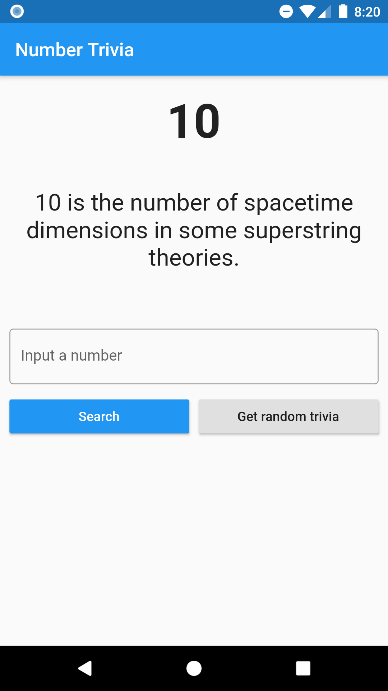
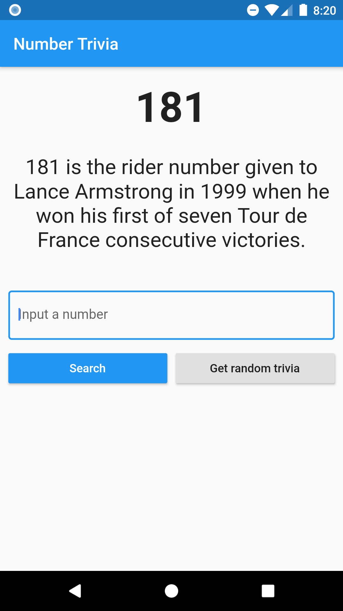

# Flutter Clean Architecture with TDD

Based on _Reso Coder_ YouTube [course](<[https://link](https://www.youtube.com/playlist?list=PLB6lc7nQ1n4iYGE_khpXRdJkJEp9WOech)>).

## Screenshots

|  |  |
| ------------------------------------------------- | ------------------------------------------------- |


## Clean Architecture proposal by _Reso_


### _lib_ structure

```
├── lib
│   ├── core
│   │   ├── errors
│   │   │   ├── exceptions.dart
│   │   │   └── failures.dart
│   │   ├── network
│   │   │   └── network_info.dart
│   │   ├── use_cases
│   │   │   └── use_case.dart
│   │   └── utils
│   │       └── input_converter.dart
│   ├── features
│   │   └── number_trivia
│   │       ├── data
│   │       │   ├── data_sources
│   │       │   │   ├── number_trivia_local_data_source.dart
│   │       │   │   └── number_trivia_remote_data_source.dart
│   │       │   ├── models
│   │       │   │   └── number_trivia_model.dart
│   │       │   └── repositories
│   │       │       └── number_trivia_repository_impl.dart
│   │       ├── domain
│   │       │   ├── entities
│   │       │   │   └── number_trivia.dart
│   │       │   ├── repositories
│   │       │   │   └── number_trivia_repository.dart
│   │       │   └── use_cases
│   │       │       ├── get_concrete_number_trivia.dart
│   │       │       └── get_random_number_trivia.dart
│   │       └── presentation
│   │           ├── bloc
│   │           │   ├── bloc.dart
│   │           │   ├── number_trivia_bloc.dart
│   │           │   ├── number_trivia_event.dart
│   │           │   └── number_trivia_state.dart
│   │           ├── pages
│   │           │   └── number_trivia_page.dart
│   │           └── widgets
│   │               ├── loading_widget.dart
│   │               ├── message_display.dart
│   │               ├── trivia_controls.dart
│   │               ├── trivia_display.dart
│   │               └── widgets.dart
│   ├── injection_container.dart
│   └── main.dart
```

### _test_ structure

```
├── test
│   ├── core
│   │   ├── network
│   │   │   └── network_info_test.dart
│   │   └── utils
│   │       └── input_converter_test.dart
│   ├── features
│   │   └── number_trivia
│   │       ├── data
│   │       │   ├── data_sources
│   │       │   │   ├── number_trivia_local_data_source_test.dart
│   │       │   │   └── number_trivia_remote_data_source_test.dart
│   │       │   ├── models
│   │       │   │   └── number_trivia_model_test.dart
│   │       │   └── repositories
│   │       │       └── number_trivia_repository_impl_test.dart
│   │       ├── domain
│   │       │   └── use_cases
│   │       │       ├── get_concrete_number_trivia_test.dart
│   │       │       └── get_random_number_trivia_test.dart
│   │       └── presentation
│   │           └── bloc
│   │               └── number_trivia_bloc_test.dart
│   └── fixtures
│       ├── fixture_reader.dart
│       ├── trivia_cached.json
│       ├── trivia_double.json
│       └── trivia.json
```

Used [gitmoji](<[https://link](https://gitmoji.carloscuesta.me/)>) for commit messages.
