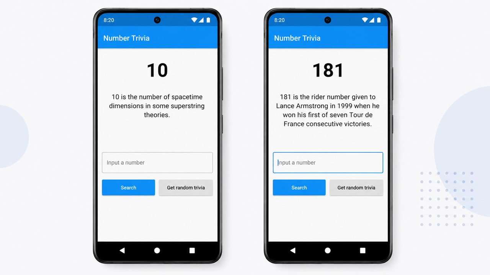
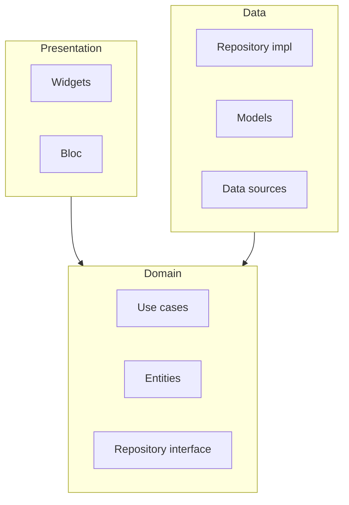
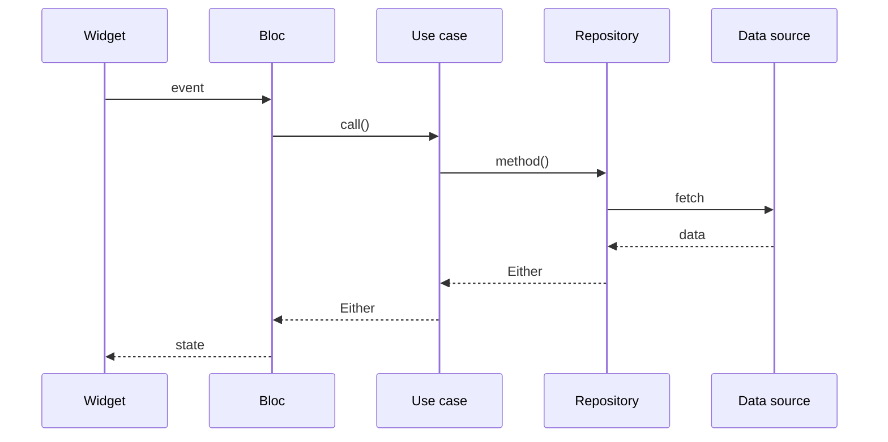

# Flutter Clean Architecture with TDD

[](https://flutter.dev)
[](https://pub.dev/packages/very_good_analysis)
[](./LICENSE)



A Flutter app that shows fun facts about numbers, built with Clean Architecture and TDD as a
reference implementation.

Originally built following Reso Coder's [Flutter TDD Clean Architecture Course](https://www.youtube.com/playlist?list=PLB6lc7nQ1n4iYGE_khpXRdJkJEp9WOech)
([original repo](https://github.com/ResoCoder/flutter-tdd-clean-architecture-course)).

## Table of Contents

- [Features](#features)
- [Architecture](#architecture)
- [Getting Started](#getting-started)
- [Testing](#testing)
- [Built With](#built-with)
- [License](#license)

## Features

- Get trivia for any non-negative integer
- Get a random trivia with a single tap
- Cache the last result for offline viewing
- Validate input and show user-facing error messages

## Architecture

The project follows Clean Architecture with three layers: Domain, Data, and Presentation.

Dependencies point inward: Presentation and Data depend on Domain, never the reverse.

### Layers


```mermaid
flowchart TD
    subgraph Presentation
        Widgets
        Bloc
    end

    subgraph Domain
        UseCases[Use cases]
        Entities
        RepositoryI[Repository interface]
    end

    subgraph Data
        RepositoryImpl[Repository impl]
        Models
        DataSources[Data sources]
    end

    Presentation --> Domain
    Data --> Domain
```

### Data flow


```mermaid
sequenceDiagram
    participant W as Widget
    participant B as Bloc
    participant UC as Use case
    participant R as Repository
    participant DS as Data source

    W->>B: event
    B->>UC: call()
    UC->>R: method()
    R->>DS: fetch
    DS-->>R: data
    R-->>UC: Either
    UC-->>B: Either
    B-->>W: state
```

### Directory structure

```
.
├── lib/
│   ├── core/              # errors, network, use_cases, utils
│   ├── features/
│   │   └── number_trivia/
│   │       ├── data/        # data_sources, models, repositories
│   │       ├── domain/      # entities, repositories, use_cases
│   │       └── presentation/ # bloc, pages, widgets
│   ├── injection_container.dart
│   └── main.dart
├── test/                  # follows lib/ layout (partial), plus fixtures/
├── android/
└── ios/
```

## Getting Started

### Prerequisites

- [Flutter 3.44+](https://flutter.dev) (Dart 3.12+)

### Install

```bash
git clone https://github.com/robsonsilv4/clean-architecture-tdd.git
cd clean-architecture-tdd
flutter pub get
```

### Run

```bash
flutter run
```

No API key or setup is required.

> The trivia API uses HTTP, which requires cleartext traffic on Android. It is already allowed
> for `number-trivia.com` via a network security config (`android/app/src/main/res/xml/network_security_config.xml`).

## Testing

```bash
flutter test                # run the test suite
flutter analyze             # static analysis
flutter test --coverage     # generate a coverage report
```

## Built With

- [flutter_bloc](https://pub.dev/packages/flutter_bloc) — state management
- [bloc](https://pub.dev/packages/bloc) — Bloc/Event/State primitives
- [dartz](https://pub.dev/packages/dartz) — functional programming (`Either`)
- [equatable](https://pub.dev/packages/equatable) — value equality
- [get_it](https://pub.dev/packages/get_it) — dependency injection
- [http](https://pub.dev/packages/http) — HTTP client
- [shared_preferences](https://pub.dev/packages/shared_preferences) — local storage
- [internet_connection_checker_plus](https://pub.dev/packages/internet_connection_checker_plus) — connectivity
- [mocktail](https://pub.dev/packages/mocktail) — mocking for tests
- [very_good_analysis](https://pub.dev/packages/very_good_analysis) — lint rules

Compared to the original:

- Dart 3 with null safety
- bloc 9 (`on<Event>` API)
- `mocktail` instead of `mockito` — no code generation
- `internet_connection_checker_plus` instead of `data_connection_checker` — no platform setup
- `very_good_analysis` lint rules
- Up-to-date Android (Gradle, Kotlin, AGP) and iOS (Swift) platform projects

## License

MIT © 2020–2026 Robson Silva. See [LICENSE](./LICENSE).
